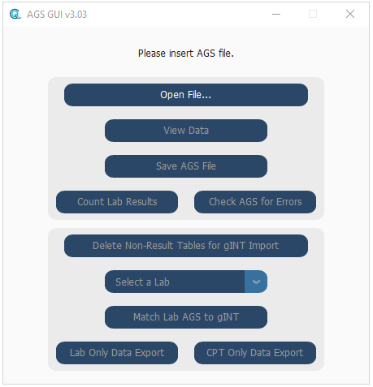

### **Open, edit and check AGS for import to an access database (gINT)**
 

#### Steps for gINT Import:
     - Open a valid AGS file
     - Delete Non-Result Tables
     - Select a laboratory from the dropdown list, then select Match Lab AGS to gINT
     - Select a gINT project when prompted by dialogue box (check the gINT is correct)
     - Once "Matching Complete!" is displayed, select 'Save AGS file'
     - Save the file when prompted by the dialogue box
     - Open gINT, go to File > Import AGS
     - Select the AGS file saved via the tool, and select the .gci import correspondence file

- [Open an AGS file](#open-an-ags-file)
- [View Data](#view-data)
- [Save AGS file](#save-ags-file)
- [Count Lab Results](#count-lab-results)
- [Check AGS for Errors](#check-ags-for-errors)
- [Delete Non-Result Tables for gINT Import](#delete-non-result-tables-for-gint-import)
- [Match Lab AGS to gINT](#match-lab-ags-to-gint)
- [CPT Only Data Export](#cpt-only-data-export)
- [Lab Only Data Export](#lab-only-data-export)
 

#### Open an AGS file
  - Open any valid AGS files.
    - There may be an error as follows: Error: Line x does not have the same number of entries as the HEADING.
    - This occurs when a description or other text field contains a line-break, which alters key formatting of the file. The line-break needs to be removed before opening the file.

#### View Data
  - This opens the AGS, which has been extracted as a dictionary of dictionaries, into PandasGUI.
    - This has some limited functionality of being to edit fields, delete tables (groups), export single tables (groups) to .csv files, as well as some filter queries.

#### Save AGS file
  - This allows the current state of the loaded AGS to be saved.
    - This includes edits in PandasGUI, or matching sample data to gINT.
    - If a filter was used in PandasGUI, it will save the new AGS with the filter applied.
    - If non-result tables were deleted, they will be deleted in the saved file.

#### Count Lab Results
  - This checks certain parent groups for specific fields relating to test type.
    - For triaxial results, like unconsolidated undrained, the sample condition is used to distinguish test type.
    - Totals of test types for each group can be exported to a .txt file.

#### Check AGS for Errors
  - This will use the AGS standard dictionary to check the file for errors.
  - The AGS version in the TRAN group will be used.
  - Version AGS 4+ supported (e.g. '4.1.1', '4.1', '4.0.4', '4.0.3', '4.0').
    - This will check the dictionary for fields named as KEY and REQUIRED as part of the error checking process to establish unique records.
    - Minor errors may arise with fields in DICT with incorrect DICT_STAT, (e.g. if a SPEC_DPTH field is not used as a KEY or REQUIRED field in DICT.DICT_STAT).
    - Error logs can be exported to a .txt file.

#### Delete Non-Result Tables for gINT Import
  - This checks the groups found in the loaded AGS file against a set list of groups expected to contain laboratory test results.
    - This is mainly used remove unwanted groups that may conflict when the file is imported to gINT (e.g. removing SAMP table to not create incorrect duplicate samples), and but also filters data (removing CPT data to improve load times for PandasGUI), and to improve match time for sample data from gINT (by removing non-used tables from the loop).
    - TRAN and PROJ are the two tables gINT need to class the AGS as readable data (with TRAN needed for the AGS version, and PROJ used as the parent of all other tables) - they are included with lab results and omitted with the correspondence file, to import only relevant data from onshore labs. 

#### Match Lab AGS to gINT
   - Matches sample data from an AGS file to a gINT database.
     - Selecting a lab from the dropdown option menu toggles between functions, as different labs require differening conditions for multiple test types to be matched correctly. 
     - Specific conditions are hard-coded to account for inconsistencies between issues of AGS from specific labs.
     - As well as amending values and placement of values, it will also rename and reformat fields to be imported into gINT.
    
#### CPT Only Data Export
  - Checks the groups found in the loaded AGS file against a set list of groups expected to contain CPT data, including sesimic.
    - Deletes all non-essential tables, keeping only CPT data.
    
#### Lab Only Data Export
  - Checks the groups found in the loaded AGS file against a set list of groups expected to contain laboratory test results.
    - Deletes all non-essential tables, keeping only Lab data as well Geology and Depth Remarks.

  

##### Developed for [Geoquip-Marine](https://www.geoquip-marine.com/) using [AGS 4 Data Format](https://www.ags.org.uk/data-format/), [python-ags4](https://pypi.org/project/python-ags4/), [PandasGUI](https://pypi.org/project/pandasgui/), [tkinter](https://docs.python.org/3/library/tkinter.html), [CustomTkinter](https://github.com/TomSchimansky/CustomTkinter).
 

   
   
 

##### Anton [(lachesis17)](https://github.com/lachesis17) 🪐
